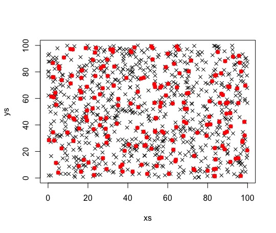

# Koncepcja multiwinner voting w algorytmach genetycznych

Multiwinner voting jest przydatny w algorytmach genetycznych w sytuacjach kiedy funkcja dopasowania (_fitness_) jest źle
dobrana lub jest "nieczuła", tj. nie bierze pod uwagę na różnorodności przedstawicieli populacji poza lokalnym minimum.
Multiwinner voting pomaga w selekcji rodziców kolejnej populacji w taki sposób, że brany jest pod uwagę zarówno fitness
osobników jak i ich zróżnicowanie.

## Multiwinner elections

Formalnie wybory to para $E=(C,V)$, taka że $C=\{c_1, ..., c_m\}$ to zbiór kandydatów a $V=(v_1,...,v_n)$ to kolekcja
wyborców. Każdy głosujący $v_i$ ustawia kandydatów w kolejności preferencji $\prec_i$ tak, że jeżeli
$a\prec_i b\prec_i c$, to głosujący woli kandydata $a$, od kandydata $b$, i kandydata $b$ od kandydata $c$. Dodatkowo
definiujemy funkcję $pos_v(c)$, taką która zwraca $1$ dla najbardziej preferowanego kandydata $c\in C$ głosującego
$v\in V$, $2$ dla drugiego itd. Do tego dobieramy protokół punktujący $\gamma$, który jako argument przyjmuje pozycję
kandydata i zwraca ilość punktów. 

Poniżej przedstawiono 2 wybrane protokoły punktujące:

* __k-Approval__ - $\alpha_k$, takie że $\alpha_k(i) = 1$ dla $1\leq i\leq k$ i $\alpha_k(i) = 1$ dla $i > k$. Czyli po
  prostu k najbardziej preferowanych kandydatów dostaje taką samą liczbę punktów, reszta kandydatów nie dostaje ich
  w ogóle.
* __Borda__ - w wyborach z $m$ kandydatami, $\beta(i)=m-i$. Na przykład w wyborach z 10 kandydatami, najbardziej
  preferowany dostaje 9 punktów, drugi 8 itd.
  
$\gamma-score$ danego kandydata $c\in C$ definiujemy jako $\sum_{v\in V}\gamma(pos_v(c))$, czyli jest to po prostu suma
punktów danego kandydata.

## Multiwinner voting rule

Mówiąc najprościej \textit{multiwinner voting rule} $R$ to reguła, która mając podane wybory $E$, protokół punktujący
$\gamma$ oraz liczbę dodatnią $k$ wyłoni zbiór $W, ||W|| = k$ kandydatów z najlepszym wynikiem (czyli takich, których
$\gamma-score$ jest najwyższy). Widzimy, że wpływ na zbiór zwycięzców ma wybór protokołu punktującego i to jakie
preferencje co do kandydatów mają głosujący.

Poniżej przedstawiono 3 wybrane reguły wyborów:

1. __SNTV__ (Single Non-Transferable Vote) - reguła wybiera k kandydatów, którzy najczęściej byli stawiani na pierwszym
   miejscu listy preferencji.
2. __Block__ - reguła wybiera k kandydatów z najwyższym wynikiem stosując regułę _k-Approval_.
3. __k-Borda__ - reguła wybiera k kandydatów z najwyższym wynikiem przy zastosowaniu reguły punktującej Borda.

Wszystkie wymienione reguły opierają się na prostej zasadzie zliczania punktów. Poniżej przedstawiono 2 dodatkowe reguły
(4 wliczając optymalizacje), działające na nieco innej  zasadzie.

### Reguła Chamberlina-Couranta

Aby zdefiniować regułę Chamberlina-Couranta (_CC rule_), najpierw musimy zdefiniować funkcję _k-CC-assignment_ $\psi$
taką, która każdemu głosującemu przypisuje jednego z co najwyżej $k$ zwycięzców. Reguła CC wyłania zwycięzców, którzy
zostali przypisani głosującym funkcją _k-CC-assignment_. Wydaje się to nieintuicyjne, ponieważ reguła nie opiera się tak
naprawdę na głosowaniu w znaczeniu jakiego spodziewalibyśmy się na codzień, ale arbitralnie wybiera zwycięzców
głosowania. W rzeczywistości to od funkcji $\psi$ zależy kto wygra wybory, i to ona pełni kluczową rolę w tej regule
(w szczególności ta funkcja może przypisywać głosującym kandydatów, którzy są na szczycie ich liście preferencji, co
byłoby równoznaczne z regułą SNTV).

Niestety obliczenie zwycięzców używając reguły CC jest problemem NP-trudnym. Istnieje natomiast optymalizacja
pozwalająca zastosować regułę w czasie wielomianowym, zwana _Greedy-CC_. Algorytm wygląda następująco: tworzymy pusty
zbiór zwycięzców $W$ i w pętli wykonujemy $k$ razy:

* dla każdego kandydata $c\in W\setminus C$ wybieramy funkcję _k-CC-assignment_ $\psi_k$, taką która każdemu
  głosującemu przypisuje kandydata z $W\cup\{c\}$, którego ten kandydat ma najwyżej na liście preferencji
* sprawdzamy, który kandydat z $c\in W\setminus C$ otrzymał najwięcej punktów w aktualnej iteracji (czyli tak
  naprawdę który kandydat został przypisany najwięcej razy)
* tego kandydata dodajemy do zbioru zwycięzców $W$

Dowiedziono, że optymalizacja Greedy-CC wyłania zwycięzców, którzy otrzymaliby conajmniej ułamek $1-\frac{1}{e}$
punktów co zwycięzcy wyłonieni przez regułę CC.

Reguła CC (również Greedy-CC), ma taką wadę, że porządkuje głosujących w grupy głosujące na tych samych kandydatów,
które mają bardzo różne rozmiary. Taka właściwość nie zawsze jest porządana. Istnieje reguła podobna do CC, która nie
przejawia tej właściwości: reguła Monroe.

### Reguła Monroe

Aby zdefiniować regułę Monroe, najpierw musimy zdefiniować _k-Monroe-assignment function_. To taka funkcja $\psi$,
która jest funkcją _k-CC-assignment_ i dodatkowo spełnia jeden z następujących warunków dla każdego $c\in C$:

* $||\psi^{-1}(c)|| = 0$
* $\lfloor\frac{n}{k}\rfloor\leq||\psi^{-1}(c)||\leq\lceil\frac{n}{k}\rceil$, gdzie n to liczba głosujących

Mówiąc prościej, albo kandydat nie został wybrany, albo zagłosowało na niego mniej więcej tyle samo głosujących co na
innych kandydatów. Jak widać, eliminuje to problem pojawiający się przy regule CC.

Niestety, wyliczenie zwycięzców przy regule Monroe również jest problemem NP-trudnym. Na szczęście dla tej reguły
również powstał algorytm obliczający zwycięzców w czasie wielomianowym i dający rozwiązanie bliskie dokładnemu.
Ten algorytm nazywa się Greedy-Monroe i działa następująco: tworzymy pusty zbiór zwycięzców $W$ i zbiór głosujących
$A=V$ (tj. na początku są w nim wszyscy głosujący) i wykonujemy w pętli $k$ razy:

* dla każdego kandydata $c\in C$ obliczamy zbiór głosujących $A_c$, taki że:
    \begin{center}
        $$A_c=argmax_{A^{'}\subseteq A,A^{'}=\frac{||V||}{k}}\sum_{v\in A^{'}}\beta(pos_v(c))$$
    \end{center}
    tj. wybieramy dla każdego kandytata taki zbiór głosujących o rozmiarze $\frac{||V||}{k}$, którzy dadzą mu
    najwięcej puktów
* wybieramy kandydata $c$ o najwyższej liczbie punktów i dodajemy go zbioru zwycięzców z $V$. Usuwamy głosujących
  należących do zbioru $A_c$ ze zbioru $A$. Dla każdego $v\in A_c$ ustawiamy $\psi(v)=c$.
  
Wyłonieni przez regułę zwycięzcy to po prostu elementy zbioru $W$.

## Selekcja w algorytmach genetycznych na podstawie multiwinner votingu

W poprzedniej sekcji omówiono koncepcję multiwinner votingu, oraz reguły pozwalające na zastosowanie tej koncepcji.
W tym podrozdziale opisaną zostane sposoby selekcji rodziców kolejnej populacji w algorytmach genetycznych przy użyciu
multiwinner votingu. Na wejściu procedury selekcji mamy elektorat $C$, będący podzbiorem populacji
$X_t=\langle x^{(1)},...,x^{(\mu)}\rangle$. Dla każdego osobnika $x^{(i)}\in C$ mamy jego fitness
$f(x^{(i)})$ (im mniejszy fitness tym osobnik jest "lepszy"). Procedura ma za zadanie wybrać $k$ osobników,
którzy będą rodzicami następnej populacji. $C$ to grupa osobników, którzy muszą zdecydować którzy z nich przeżyją.
W [@faliszewski2016multiwinner] autorzy założyli, że przedstawiciele populacji kierują się dwoma podstawowymi czynnikami
przy wyborze, którzy osobnicy wg nich mają zostać rodzicami kolejnej generacji:

* każdy osobnik chce albo przeżyć sam, albo żeby przeżył osobnik jak najbardziej podobny do niego (bo ma podobne cechy)
* osobnicy chcą, aby kolejna populacja była tak dobra jak tylko się da (wg zdefiniowanego fitnessu)

Wcześniej zostało wspomniane, że reguła multiwinner votingu zależy od preferencji poszczególnych głosujących i protokołu
punktującego (które zostały już omówione). W celu ustalenia preferencji poszczególnych osobników, zdefiniujmy
_utility function_ $u_i$. Im wyższa wartość funkcji $u_i(x^{(j)})$, tym chętniej osobnik $x^{(i)}$ wybierze
osobnika $x^{(j)}$ (czyli tym wyżej ustawi go na liście preferencji). Funkcję $u_i$ należy należy zaprojektować tak,
żeby brała pod uwagę dwa wyżej wymienione czynniki. W tym celu musimy zdefiniować funkcję "odwracającą" $h$, taką że
$h(f(x^{(i)})) \geq h(f(x^{(j)})) \iff f(x^{(i)}) \leq f(x^{(j)})$. Teraz możemy zdefiniować funkcję $u_i$
następująco:

\begin{center}
    $$u_i(x^{(j)}) = \frac{h(f(x^{(j)}))}{d(x^{(i)},x^{(j)})}$$
\end{center}

gdzie $d$ to funkcja "odległości", albo podobieństwa, między osobnikami (im ta wartość jest mniejsza tym osobnicy są
bardziej do siebie podobni; przykładowo, jeśli osobnicy to punkty w dwuwymiarowej przestrzeni Euklidesowej, to $d$
możemy zdefiniować jako odległość między dwoma punktami). Widzimy, że tak zdefiniowana funkcja $u_i$ spełnia
postawione wymagania, tj.:

* jej wartość jest maksymalna dla tego samego osobnika ($\to +\infty$)
* jej wartość jest tym mniejsza, im osobnicy są mniej do siebie podobni
* jej wartość jest tym większa, im osobnik ma lepszy fitness

W ogólności możemy zdefiniować funkcję $u_i$ jako $u_i(x^{(j)}) = \gamma(h(f(x^{(j)})))\delta(d(x^{(i)},x^{(j)}))$,
gdzie $\gamma,\delta:\mathbb{R}\to\mathbb{R}$.

### Charakterystyka reguł multiwinner votingu przy użyciu do selekcji w algorytmach genetycznych

Mając odpowiednią _utility function_ oraz regułę multiwinner votingu, algorytm selekcji wydaje się być trywialny.
Dla każdego głosującego osobnika ustawiamy jego preferencje wg funkcji $u_i$. Następnie aplikujemy wybraną regułę
multiwinner votingu i wyłaniamy zwycięzców. Jakość procedury selekcji w dużej mierze zależy od jakości wybranej reguły
multiwinner votingu.

Poniżej opisane zostało zachowanie poszczególnych reguł w algorytmach selekcji. Dla potrzeb charakterystki, załóżmy
sytuację że przedstawiciele populacji to punkty na płaszczyźnie dwuwymiarowej, a funkcja $d$ to po prostu odległość
między dwoma obiektami na płaszczyźnie. W patologicznej sytuacji kiedy fitness osobników jest taki sam (mimo tego, że
osobnicy różnią się od siebie), będą oni preferowali osobników leżących najbliżej nich samych na płaszczyźnie
(najbardziej do nich podobnych).

Warto zaznaczyć dlaczego opis takich charakterystyk jest istotny. Sytuacja, kiedy w selekcji kierujemy się tylko
podobieństwem (odległością) osobników (punktów) to dokładnie taka, w której użycie multiwinner votingu ma sens 
w algorytmach genetycznych - tzn. kiedy osobnicy mają bardzo zbliżoną do siebie wartość fitnessu. Używając standardowej
selekcji, tylko na podstawie fitnessu, wybralibyśmy osobników o najniższej jego wartości, najbliżej pewnego lokalnego
minimum jak to możliwe. Używająć multiwinner votingu możemy wybrać osobników o zadowalającym fitnessie, ale przy tym
odpowiednio różnorodnych, którzy mogliby przekazać odpowiednie cechy kolejnej generacji.

To, że głosowanie na podobnych osobników daje różnorodność przy selekcji wydaje się być nieintuicyjne. Warto jednak
zauważyć, że gdy osobników jest wielu a każdy głosuje na najbardziej podobnego do siebie, to wcale nie znaczy, że
wszyscy ci najbardziej podobni zostaną wybrani. W ostatecznym rozstrzygnięciu liczy się jak wiele punktów dostali
poszczególni osobnicy, więc zwycięzcy tworzą pewnego rodzaju konsensus wyboru całej populacji.

#### SNTV

Dla przypomnienia - w regule SNTV wybieramy osobników, którzy zostali ustawieni na pierwszym miejscu preferencji
głosujących największą liczbę razy. Zatem w omawianej tutaj sytuacji, wybrane zostaną punkty, które są najbliższymi
sąsiadami największej liczby punktów. Jeśli punkty są równomiernie rozłożone, to wszyscy wygrani dostaną podobną liczbę
głosów i będą ułożenia w niewielkich "klastrach" (2-3 osobników) na płaszczyźnie, jak na rysunku \ref{fig:sntv-selection}.

{width=50%}

#### Bloc

W regule Bloc równa liczba punktów przyznawana jest k kandydatom znajdującym się najwyżej listy preferencji.
W omawianym przypadku będzie to k punktów najbliższych danemu głosującemu. Oznacza to, że szansę na zwycięstwo mają
punkty, które leżą blisko innych punktów. Można pomyśleć tej regule jak o rozszerzeniu SNTV - wybieramy kandydatów,
którzy najczęściej zostawali stawiani na pierwszych k miejscach listy preferencji. Oznacza to, że dalej będą występowały
obszary "skupienia" zwycięzców, ale jako że bardziej oddalone punkty mają taką samą "siłę" głosu jak te w pobliżu, to
te obszary będą większe niż przy użyciu SNTV (rysunek \ref{fig:bloc-selection}).

![Przykład selekcji punktów przy regule Bloc, źródło: [@faliszewski2016multiwinner]\label{fig:bloc-selection}](figures/bloc-selection.png){width=50%}

Wynika z tego, że użycie reguły Bloc nie poprawi różnorodności przy selekcji w algorytmie genetycznym.

#### k-Borda

Przy regule k-Borda, kandydaci otrzymują tym mniej punktów im niżej znajdują się na liście preferencji, a ostatni
kandydat nie otrzymuje punktów w ogóle. Jest to poniekąd połączenie reguł SNTV i Bloc, gdzie najwyżej stawiani
kandydaci dostają najwięcej punktów, ale ci stawiani niżej wciąż mają szansę na zwycięstwo. Dlatego przy użyciu tej
reguły wybrane będą punkty otoczone przez wiele innych punktów (niekoniecznie położonych blisko nich) skupione
w jednym obszarze, jak pokazano na rysunku \ref{fig:k-borda-selection}.

![Przykład selekcji punktów przy regule k-Borda, źródło: [@faliszewski2016multiwinner]\label{fig:k-borda-selection}](figures/k-borda-selection.png){width=50%}

Wynika z tego, że użycie reguły k-Borda nie poprawi różnorodności przy selekcji w algorytmie genetycznym.

#### Greedy-CC

Intuicyjnie, ta reguła (wraz z regułą Greedy-Monroe) wydaje się być najbardziej _fair_, ponieważ w każdej iteracji
algorytmu dodajemy do grona zwycięzców kandydata, którego najwięcej głosujących postawiło na pierwszym miejscu. Z racji
tego, wybrani zwycięzcy są równomiernie rozłożeni wśród wszystkich punktów (rysunek \ref{fig:cc-selection}).

![Przykład selekcji punktów przy regule Greedy-CC, źródło: [@faliszewski2016multiwinner]\label{fig:cc-selection}](figures/cc-selection.png){width=50%}

Widzimy, że użycie tej reguły zapewnia pewien stopień różnorodności, z pewnością dużo lepszy niż k-Borda lub Bloc.

#### Greedy-Monroe

Greedy-Monroe to algorytm podobny do Greedy-CC, i wynik selekcji z użyciem go jest podobny do tego z użyciem CC:
punkty-zwycięzcy równomiernie rozłożeni na płaszczyźnie (rysunek \ref{fig:monroe-selection}).

![Przykład selekcji punktów przy regule Greedy-Monroe, źródło: [@faliszewski2016multiwinner]\label{fig:monroe-selection}](figures/monroe-selection.png){width=50%}

Widzimy, że użycie tej reguły zapewnia pewien stopień różnorodności, z pewnością dużo lepszy niż k-Borda lub Bloc.

## Zastosowanie w algorytmach genetycznych

Jak już wcześniej zostało wspomniane, multiwinner voting ma zastosowanie w algorytmach genetycznych, w przypadku kiedy
chcemy wybrać z aktualnej generacji rodziców kolejnej, ale wartość funkcji fitness dla osobników poza pewnym lokalnym
minimum jest bardzo do siebie zbliżona. Weźmy za przykład populację pokazaną na rysunku \ref{fig:ga-example-1}
(na wykresie widzimy linie proste, ale załóżmy że są lekko pochylone w stronę wybrzuszenia w centrum).

{width=50%}

Na osi X zaznaczono pewną cechę osobników, im położone siebie są punkty na osi X, tym bardziej osobnicy są do siebie
podobni (oczywiście cech osobników może być więcej, to jest tylko najprostszy przykład). Na osi Y zaznaczono fitness
osobników. Widzimy, że osobnicy zaznaczeni na zielono mają najlepszą wartość funkcji fitnessu, dlatego warto wybrać
ich do grona rodziców kolejnej generacji, aby mogła osiągnąć ona ogólnie możliwie dobry fitness. Jednak reszta populacji
ma fitness bardzo do siebie zbliżony. W najprostszym podejściu do grona rodziców dobralibyśmy tych o możliwie najlepszej
wartości fitnessu (zaznaczeni na niebiesko na rysunku \ref{fig:ga-example-2}), jednak trzeba zauważyć że są to osobnicy
bardzo do siebie podobni. Skrzyżowanie ich do stworzenia kolejnej populacji da zapewne osobników również bardzo
podobnych, i możemy "przegapić" możliwą grupę osobników o innej wartości badanej cechy, którzy przy krzyżowaniu mogą
stworzyć nowego osobnika o jeszcze lepszej wartości fitnessu.

{width=50%}

Multiwinner voting ma właśnie pomagać w "eksploracji" tej płaszczyzny, czyli wyborze jak najbardziej różnych od siebie
osobników z grona tych o zbliżonej do siebie wartości fitnessu. Dużą rolę tutaj gra wybów odpowiedniej reguły głosowania,
np. wybranie reguły k-Borda spowoduje, że wybierzemy osobników ze środków tych płaskich obszarów fitnessu (na czerwono
na rysunku \ref{fig:ga-example-3}). Natomiast użycie Greedy-CC lub Greedy-Monroe zapewni odpowiednie rozproszenie
wybranych osobników na tych płaskich fragmentach, dzięki czemy wybierzemy możliwie różnorodnych osobników (na czerwono
na rysunku \ref{fig:ga-example-4}).

{width=50%}

{width=50%}

### Algorytm

Poniżej przedstawiono przykładowy algorytm genetyczny, który używa multiwinner votingu do selekcji, w postaci pseudokodu:

```
run() {
    population = createInitialPopulation()
    population = evaluatePopulation(population)
    initProgress()
    
    while (!isStoppingConditionReached()) {
        matingPopulation = selection(population)
        offspringPopulation = reproduction(matingPopulation)
        offspringPopulation = evaluatePopulation(offspringPopulation)
        population = replacement(population, offspringPopulation)
        updateProgress()
    }
}

selection(population) {
    electionGroup = pickElectionGroup(n) // n to może być liczba osobników całej populacji
    for(l in 0..(n - 1)) { // ustawiamy preferencje każdego osobnika po kolei
        for(i, j in 0..(n -1), i < j) { // rozważamy wszystkie pary osobników
            uI = utilityFunction(electionGroup[i], electionGroup[l])
            uJ = utilityFunction(electionGroup[j], electionGroup[l])
            if (uI >= uJ) {
                electionGroup[l].setPreference(i, j) // osobnik l woli osobnika i niż j
            } 
            else {
                electionGroup[l].setPreference(j, i) // osobnik l woli osobnika j niż i
            }
        }
    }
    // mając preferencje możemy przeprowadzić wybory używając dowolnej reguły
    return runElections(electionGroup) 
}

utilityFuncton(individualA, individualB) {
    fitenss(individualA) / distance(individualB, individualA)
}

```

## Podsumowanie

Wykorzystanie multiwinner votingu do algorytmów genetycznych pozwala na wybranie różnorodnych osobników jako rodziców
kolejnego pokolenia w sytuacji kiedy fitness osobników jest mało zróżnicowany. Jakość tej metody zależy w dużej mierze
od wybranej metody ustawiania preferencji osobników, punktowania głosów oraz tzw. _multiwinner voting rule_.
Przedstawiona _utility function_ pozwala na ustawienie preferencji głosujących w sposób pasujący do reguł algorytmów
genetycznych (osobnicy chcą aby przeżyli inni osobnicy podobni jak najbardziej do nich), a zastosowanie reguł Greedy-CC
lub Greedy-Monroe do selekcji generuje zbiór zróżnicowanych osobników.

# Literatura